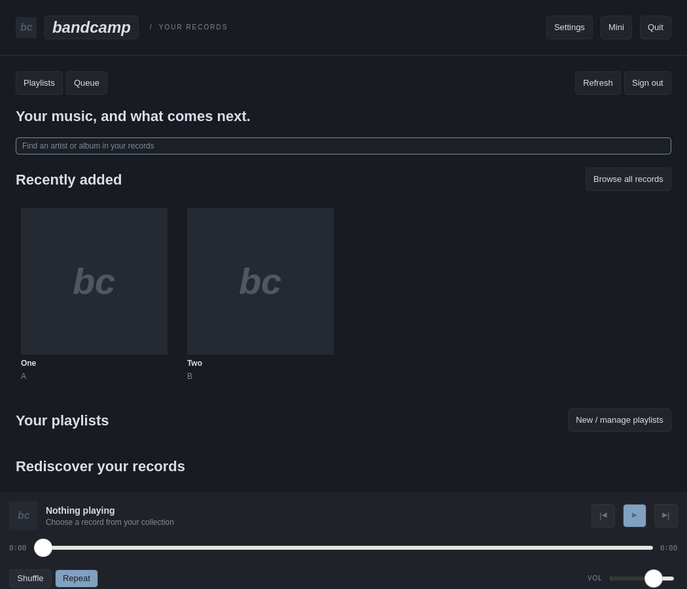
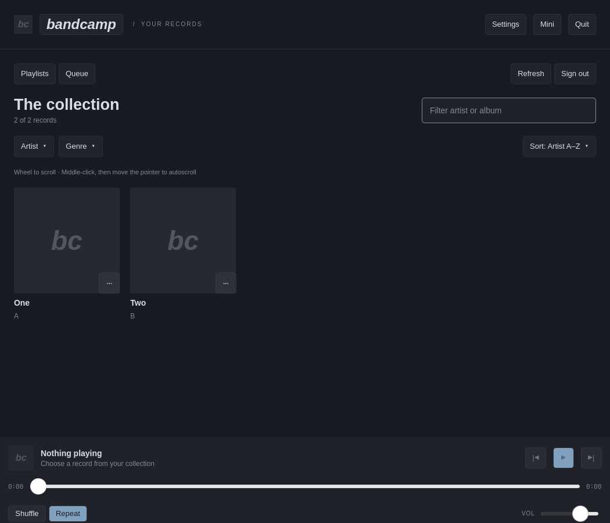

# Omarchy Bandcamp

A native Omarchy player for your purchased Bandcamp collection. Browse records, filter by artist, genre or tag, queue tracks and albums, manage playlists, and control playback from the bar, mini player, or media keys. The interface follows the active Omarchy theme. Playback uses mpv and Bandcamp's Subsonic beta; it does not run a browser.



## Install

Requires **Omarchy 4 with Quickshell**, `uv`, and `mpv`. Install `libsecret` as well to remember your login in the desktop keyring. On Omarchy:

```bash
sudo pacman -S --needed uv mpv libsecret
omarchy plugin add https://github.com/killgallic/omarchy-bandcamp.git --enable
~/.config/omarchy/plugins/killgallic.bandcamp/bin/setup
```

Open **Bandcamp** with Super+Space. The bar entry appears while the app runs and disappears when you Quit. Setup creates a user launcher, desktop entry, icon, and a locked Python environment under `$XDG_DATA_HOME/omarchy-bandcamp/venv` (normally `~/.local/share/omarchy-bandcamp/venv`). The plugin itself stays free of generated dependencies so Omarchy can validate and update it. No setup command runs when the plugin is merely added or enabled.

For source development, clone the repository and run `bin/setup`; `bin/omarchy-bandcamp --standalone` launches without registering the plugin. The regular command opens the Omarchy plugin when installed.

## Connect your collection

1. In [Bandcamp Fan Settings](https://bandcamp.com/settings?pane=fan), find **Subsonic** and generate credentials.
2. Enter that generated username and password in Bandcamp. Your normal Bandcamp password is not the Subsonic password.
3. Keep **Remember securely on this computer** selected to reconnect automatically through Secret Service, or turn it off for a session-only login.
4. Optionally enter your public Bandcamp profile URL for your profile picture.

The server is fixed to `https://bandcamp.com/api/subsonic`. Passwords are not stored in app configuration or passed as process arguments. The player checks collection access during login. A cached collection can be browsed offline after a previous successful sign-in, but playback and playlist changes need a connection.

## Use

Home shows favourite records, recent additions, playlists, and Bandcamp discovery links. **Collection**, **Playlists**, and **Queue** are in the top navigation. Click the profile image or Bandcamp wordmark to return Home. Right-click album art or a track to queue it, add it to a playlist, or open further actions. Create empty playlists from Playlists. Album menus can favourite or hide a record; Collection has a Hidden view for restoring it. These choices are local and never change your Bandcamp purchases.

Click the bar entry to open the full player, right-click for the mini player, middle-click to pause or resume, or scroll to change tracks. Settings lets you remap left and right clicks, choose or customise now-playing text, adjust wheel speed and acceleration, and set window sizes. Closing the full player leaves playback running; Quit stops playback. Media keys use MPRIS.

Collection filters combine artist, genre and MusicBrainz tags. Choices can be sorted by record count or name. Recently added uses the collection-added timestamp where Bandcamp provides it. Most played and recently played use listens in this app only. Optional MusicBrainz enrichment sends artist and album names to its public API; use **Generate tags** in Settings to run it and see scan progress and coverage. Playback does not depend on MusicBrainz.

The cache limit and collection snapshot age are configurable in Settings. Artwork, collection snapshots and optional metadata live under `$XDG_CACHE_HOME/omarchy-bandcamp` (normally `~/.cache/omarchy-bandcamp`). Settings live under `$XDG_CONFIG_HOME/omarchy-bandcamp`, and local favourites, hidden records and listening history under `$XDG_STATE_HOME/omarchy-bandcamp`. Clearing the cache does not delete purchases, playlists, or saved login.

Bandcamp Discover, Daily, artist pages, and release pages open in a browser. The Subsonic beta does not provide every public Bandcamp feature, and some releases only have a labelled search link when their exact public URL cannot be verified. Downloads are not implemented. Stream failures retry with fresh URLs and show a toolbar status with a retry action.



## Update or remove

```bash
omarchy plugin update killgallic.bandcamp
~/.config/omarchy/plugins/killgallic.bandcamp/bin/setup
```

Rerun setup after an update to refresh the locked Python environment and desktop files. To remove the app, Quit first, then run:

```bash
~/.config/omarchy/plugins/killgallic.bandcamp/bin/uninstall
omarchy plugin remove killgallic.bandcamp
```

Uninstall preserves settings, cache, local history and playlists, and the saved keyring login. Remove those separately if you want to erase local data. It leaves user-modified launcher files in place rather than deleting them.

## Contribute

See [CONTRIBUTING.md](CONTRIBUTING.md) for architecture, local setup, tests and PR guidance. Issues and PRs are welcome; use synthetic fixtures and redact account details. Security reports belong in the private channel described in [SECURITY.md](SECURITY.md). Changes are listed in [CHANGELOG.md](CHANGELOG.md).

Omarchy Bandcamp is an independent project, unaffiliated with Bandcamp. Bandcamp's Subsonic interface is a beta and may change.
